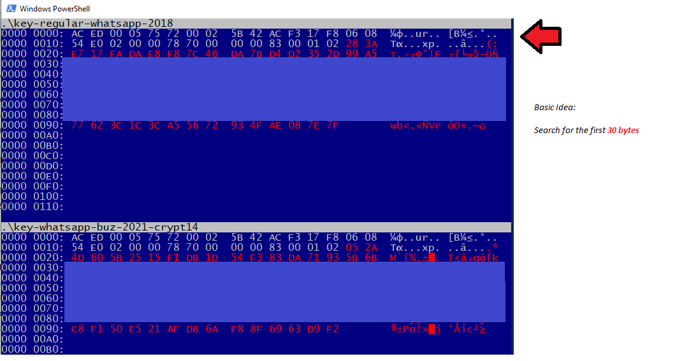

## WhatsApp-key-carver
Have you ever noticed UFED Physical Analyzer not decrypting every WhatsApp database?
Do you know that there is a pattern?? Try using this tool to find "lost" keys!

## Installation 
Pre built binary for windows: [whatsapp-carver.exe](https://github.com/leosol/whatsapp-key-carver/tree/main/build)
Sources included. Its very easy to build in linux and windows with cygwin

## Basic Idea 

Search for the very first 30 bytes in the whole mmcblk0. Take a look at the diff between a 2018 key and a 2021 key (up to encrypting crypto14 files)




## Usage:
```
.\whatsapp-carver.exe MMCBLK0.dd
```

